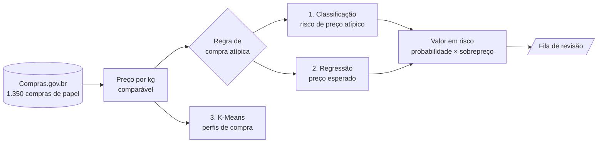

<div align="center">

# 🧾 Compras públicas com preço atípico

### Classificação de compras com preço fora do padrão e previsão do preço esperado, com Machine Learning Clássico


[](https://colab.research.google.com/github/SEU_USUARIO/SEU_REPOSITORIO/blob/main/Projeto_ML_Compras_Gov.ipynb)

**Tema 5.4: Compras.gov.br, compra atípica e preço esperado**

Projeto Final da disciplina de Machine Learning Clássico

</div>

---

## 📌 Sobre o projeto

Todo órgão público compra papel para impressão, e a lei exige que o preço pago seja compatível com o de mercado. Na prática, o controle é manual: o servidor junta alguns preços, a auditoria revisa só uma amostra e o que fica fora dela passa sem ser visto.

Este projeto responde a uma pergunta:

> **Quais compras merecem revisão por terem preço fora do padrão de itens comparáveis?**

O resultado é uma **fila de revisão** que ordena as compras pelo dinheiro que pode ter sido pago a mais, para a equipe de controle olhar primeiro o que mais importa.

> ⚠️ **Aviso importante:** o projeto **não fala em fraude**. Uma compra "atípica" é só uma compra cujo preço foge do padrão e que, por isso, merece ser olhada por uma pessoa. Muitas vezes a explicação é um erro de cadastro, um frete caro ou um item diferente.

## 🧭 Como funciona



| Etapa | Tipo | O que faz |
|---|---|---|
| **1. Classificação** | Binária | Prevê se a compra tem perfil de risco de sair com preço atípico, usando só o que se sabe **antes** de olhar o preço |
| **2. Regressão** | Valor contínuo | Estima o preço esperado da compra, em R$ por quilo de papel |
| **3. K-Means** *(opcional)* | Não supervisionado | Mostra que perfis de compra existem na base |
| **Fila de revisão** | Junção das etapas 1 e 2 | Ordena as compras por **valor em risco** = probabilidade de ser atípica × valor pago acima do esperado |

## 🗂️ Dados

| | |
|---|---|
| **Fonte** | [API de Dados Abertos do Compras.gov.br](https://dadosabertos.compras.gov.br/swagger-ui/index.html), módulo de Pesquisa de Preço |
| **Item** | Papel para impressão formatado (PDM 19746 do catálogo CATMAT) |
| **Tamanho** | 1.350 compras reais, de 8/ago a 31/dez de 2025 |
| **Cobertura** | 646 unidades compradoras, 27 estados, 3 esferas (593 federais, 399 estaduais, 358 municipais), 124 itens do catálogo e 447 fornecedores |
| **Arquivo** | `compras_papel_2025.csv` |
| **Acesso** | 25 de setembro de 2026 |

As características de cada papel (tipo, tamanho, gramatura e cor) vieram do catálogo de materiais, rota `4_consultarItemMaterial`.

## 🔬 Metodologia

### 1. Preço comparável: reais por quilo de papel

O mesmo papel é vendido por folha, por pacote de 50 ou por resma de 500, e uma folha A3 tem o dobro de papel de uma A4. Comparar o preço bruto seria comparar laranja com caixa de laranja. Por isso tudo é convertido para **R$ por kg**:

```
kg por unidade = folhas por unidade × área da folha (m²) × gramatura (g/m²) ÷ 1000
preço por kg   = preço unitário ÷ kg por unidade
```

Exemplo: uma resma A4 de 75 g/m² pesa 2,34 kg. Se custou R$ 20,00, são R$ 8,55 por kg.

### 2. Regra de compra atípica

Uma compra é **atípica** quando o preço por kg passa de **Q3 + 1,5 × IQR** do seu grupo de papel (a mesma regra dos pontos extremos de um boxplot, de Tukey). *(Q3 + 1,5 × IQR é o preço máximo considerado normal: o topo da faixa típica de preços do grupo, mais uma folga de 1,5 vez a largura dessa faixa. Acima disso, a compra é atípica.)*

Os quartis são calculados **só com as compras de treino**.

| Grupo | Q1 | Mediana | Q3 | Limite atípico (R$/kg) |
|---|---:|---:|---:|---:|
| Sulfite | 8,47 | 10,26 | 14,69 | **24,01** |
| Reciclado | 9,60 | 10,68 | 13,90 | **20,34** |
| Offset | 9,65 | 11,54 | 33,20 | **68,54** |
| Couchê | 11,26 | 19,43 | 34,38 | **69,05** |
| Especial (texturizado e permanente) | 20,15 | 32,96 | 47,57 | **88,69** |

No total, **180 das 1.350 compras (13,3%)** são atípicas.

### 3. Preparação dos dados

- **Divisão:** 80% treino (1.080) e 20% teste (270), estratificada pelo tipo de papel e feita **antes** de criar o alvo. Com a validação cruzada em 5 partes dentro do treino, ficam 64% treino, 16% validação e 20% teste.
- **Sem preço na classificação:** o alvo é feito a partir do preço, então a classificação usa só o que se sabe antes dele: o que se compra, quanto, de que forma e por quem.
- **Codificação:** One-Hot nas categorias (tipo de papel, modalidade, esfera e região).
- **Padronização:** `StandardScaler` nas numéricas (há valores extremos, que prejudicariam o `MinMaxScaler`), tudo dentro de um `Pipeline` para evitar vazamento de dados.
- **Atributos criados:** `preco_kg`, `area_m2`, `gramatura_g`, `folhas_unid`, `log_quantidade`, `log_kg_total`, `unidade_folha`, `formato_a4`, `cor_branca`, `registro_precos`, `regiao` e `mes`.

### 4. Modelos e ajuste

| Tarefa | Modelos | Ajuste |
|---|---|---|
| Classificação | Regressão Logística e **Random Forest** | `GridSearchCV`, 5 partes, critério F1 |
| Regressão | Linear Simples, Linear Múltipla, Polinomial grau 2 (Ridge) e **Random Forest Regressor** | `GridSearchCV`, 5 partes, critério MAE |
| Perfis | K-Means | k escolhido pelo coeficiente de silhueta |

Na classificação, `class_weight` balanceado faz o erro sobre as atípicas pesar mais. Na regressão, o treino usa só as compras típicas e o modelo aprende o **log** do preço por kg.

## 📊 Resultados

### Classificação: risco de compra atípica (270 compras de teste, 34 atípicas)

| Modelo | Acurácia | Precision | Recall | **F1** | **ROC-AUC** | Apontadas |
|---|---:|---:|---:|---:|---:|---:|
| 🏆 **Random Forest** | 88,9% | 55,3% | 61,8% | **0,583** | **0,917** | 14,1% |
| Regressão Logística | 80,7% | 36,8% | 73,5% | 0,490 | 0,874 | 25,2% |

O modelo foi escolhido pelo **F1**, não pela acurácia: com só 13% de atípicas, dizer que "nenhuma é atípica" já acerta 87% e não serve para nada. A Logística pega mais atípicas (Recall maior), mas aponta uma em cada quatro compras, o que gera muito alarme falso.


### O que mais pesa na decisão

As variáveis mais importantes do Random Forest são os **quilos totais comprados (0,289)**, as **folhas por embalagem (0,153)**, a **quantidade (0,142)** e o **cadastro por folha (0,062)**. Todas descrevem *como a quantidade e a unidade foram registradas*.

> 💡 **Descoberta principal:** o sinal mais forte de preço atípico não é quem compra nem como compra. É a **unidade de fornecimento não bater com o preço**. Entre as compras cadastradas por folha, **51,8% são atípicas**, contra **9,9%** das cadastradas por embalagem.


### Regressão: preço esperado (compras típicas de teste, R$ por kg)

| Modelo | MAE | RMSE | Erro mediano | MAPE | R² |
|---|---:|---:|---:|---:|---:|
| 🏆 **Random Forest Regressor** | **2,78** | **6,20** | **0,87** | **22,3%** | **0,580** |
| Linear Múltipla | 3,98 | 7,83 | 1,99 | 34,0% | 0,332 |
| Linear Simples (gramatura) | 4,89 | 9,38 | 2,01 | 45,8% | 0,039 |
| Polinomial grau 2 (Ridge) | 6,42 | 43,50 | 1,62 | 42,9% | −19,652 |

A Polinomial mostra o risco de extrapolar: numa única compra rara, previu R$ 686/kg para um papel que custou R$ 25, e esse ponto derrubou o R². Sem ele, o R² dela seria 0,515. Para a resma A4 de 75 g/m², o modelo estima **R$ 22,90**, contra **R$ 23,14** do preço real mediano.


### Fila de revisão (base de teste)

| Indicador | Valor |
|---|---:|
| Compras na base de teste | 270 |
| Valor em risco estimado | R$ 1,59 milhão |
| Parcela do valor em risco nos 10% do topo (27 compras) | **97,9%** |
| Compras atípicas nos 10% do topo | **81,5%** |
| Compras atípicas na base de teste toda | 12,6% |
| Ganho sobre escolher ao acaso (lift) | **6,5×** |
| Compras do topo com preço 5× ou mais acima do esperado | 20 de 27 |

Das 27 compras do topo, 20 têm preço 5 vezes ou mais acima do esperado, o que quase sempre é **erro de unidade no cadastro**, e não dinheiro pago a mais. Só 3 ficam entre 1,5 e 5 vezes o esperado, a faixa onde está o candidato a sobrepreço real. Por isso o R$ 1,59 milhão **não deve ser lido como prejuízo**, e sim como o tamanho da distorção que chega à base de preços.

### K-Means: perfis de compra

A melhor silhueta foi com **2 grupos (0,681)**:

| Grupo | Compras | Preço relativo mediano | Cadastradas por folha | Atípicas |
|---|---:|---:|---:|---:|
| 0 | 120 | 8,4× o do grupo | 91% | 57% |
| 1 | 1.230 | 1,0× | 0% | 9% |


## ✅ Recomendação prática

1. **Na entrada dos dados:** validar a unidade de fornecimento e a capacidade da embalagem quando o preço por kg sair muito do padrão. Isso limpa a base de preços que todo o governo usa como referência.
2. **Na revisão:** mandar para análise humana as compras do topo da fila que não forem erro de unidade, que são as candidatas a sobrepreço real.

O modelo não substitui o auditor nem acusa ninguém. Ele só organiza o que deve ser olhado primeiro.

## 🚀 Como executar

### Opção 1: Google Colab (recomendado)

1. Clique no botão **Abrir no Google Colab** no topo deste README.
2. Rode a primeira célula. Se o arquivo `compras_papel_2025.csv` não estiver na pasta, o Colab abre uma janela para você enviá-lo.
3. Use **Ambiente de execução → Executar tudo**. Não precisa de GPU e leva poucos minutos.

### Opção 2: Localmente

```bash
git clone https://github.com/SEU_USUARIO/SEU_REPOSITORIO.git
cd SEU_REPOSITORIO

python -m venv .venv
source .venv/bin/activate        # Windows: .venv\Scripts\activate

pip install pandas numpy scikit-learn matplotlib seaborn jupyter
jupyter notebook Projeto_ML_Compras_Gov.ipynb
```

Coloque o `compras_papel_2025.csv` na mesma pasta do notebook. A semente aleatória é fixada em **42**, então os resultados se repetem a cada execução com o mesmo arquivo de dados.

### (Opcional) Atualizar a base pela API

No notebook, a seção 1.1 tem a função `coletar_precos()`, que baixa a mesma consulta direto do Compras.gov.br. Ela não roda por padrão, para que os números do relatório se repitam. Para usá-la, troque `COLETAR_DA_API` para `True`.

## 📁 Estrutura do repositório

```
.
├── Projeto_ML_Compras_Gov.ipynb     # notebook com o pipeline completo
├── compras_papel_2025.csv           # base de compras de papel (1.350 linhas)
├── figuras/                         # gráficos gerados pelo notebook
│   ├── fig1_eda.png
│   ├── fig2_classificacao.png
│   ├── fig3_importancia.png
│   ├── fig4_regressao.png
│   └── fig5_kmeans.png
├── Projeto_Final_Compras_Gov.docx   # relatório final (ABNT)
└── README.md
```

## ⚠️ Limitações

- A base cobre só **cinco meses** (agosto a dezembro de 2025) e **um tipo de item**. Para outros itens seria preciso treinar de novo.
- Foram usadas as 1.350 compras mais recentes de 2025 devolvidas pela API, e não o ano todo.
- O rótulo vem de uma regra estatística (Q3 + 1,5 × IQR). O modelo aprende essa regra, e **compra atípica não é o mesmo que compra irregular**. Mudar o corte muda os resultados.
- O sobrepreço estimado está inflado por erros de cadastro e **não é prejuízo real**.
- A base não tem frete, prazo de entrega nem marca exigida, que também explicam diferenças de preço.
- O modelo mostra associação, não causa. Nenhuma variável prova que houve irregularidade.

## 📚 Referências principais

- BRASIL. **Lei nº 14.133/2021**. Lei de Licitações e Contratos Administrativos.
- BRASIL. **Instrução Normativa SEGES/ME nº 65/2021**. Pesquisa de preços.
- BRASIL. Controladoria-Geral da União. **Alice: Analisador de Licitações, Contratos e Editais**. 2025.
- RIBEIRO, C. G.; INÁCIO JÚNIOR, E. **O mercado de compras governamentais brasileiro (2006-2017)**. Brasília: Ipea, 2019.
- BREIMAN, L. Random Forests. *Machine Learning*, v. 45, n. 1, 2001.
- PEDREGOSA, F. et al. Scikit-learn: Machine Learning in Python. *JMLR*, v. 12, 2011.
- TUKEY, J. W. *Exploratory Data Analysis*. Addison-Wesley, 1977.

A lista completa está no relatório (`Projeto_Final_Compras_Gov.docx`).

## 👥 Autores

**Mateo Zapelini** e **Miguel Torres**

Disciplina: Machine Learning Clássico | Professor: Rodrigo Ramos Silva | 2026
